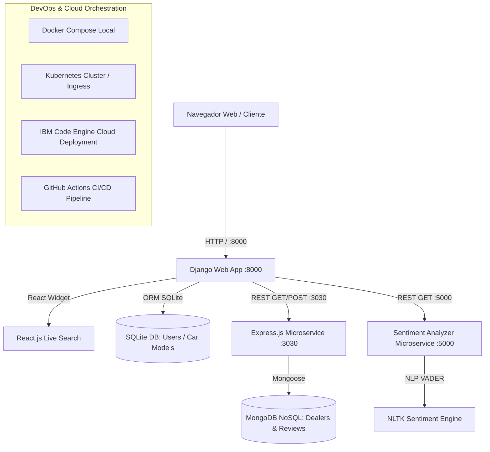

# 🚗 AutoPulse - Plataforma de Concesionarios y Análisis de Sentimiento

[](https://github.com/usuario/autopulse-dealerships/actions/workflows/ci-cd.yml)
[](https://www.docker.com/)
[](https://kubernetes.io/)
[](https://cloud.ibm.com/)
[](https://opensource.org/licenses/MIT)

Plataforma empresarial Full Stack híbrida basada en microservicios para la gestión nacional de concesionarios de automóviles, evaluación de vehículos y análisis de sentimiento automatizado mediante procesamiento de lenguaje natural (NLP).

---

## 📑 Tabla de Contenidos
1. [Arquitectura del Sistema](#1-arquitectura-del-sistema)
2. [Stack Tecnológico](#2-stack-tecnológico)
3. [Estructura del Repositorio](#3-estructura-del-repositorio)
4. [Instalación y Despliegue Local (Docker Compose)](#4-instalación-y-despliegue-local-docker-compose)
5. [Guía de Endpoints del Backend](#5-guía-de-endpoints-del-backend)
6. [Guía de Verificación y Rúbrica de Calificación (Screenshots)](#6-guía-de-verificación-y-rúbrica-de-calificación-screenshots)
7. [Despliegue en Kubernetes e IBM Code Engine](#7-despliegue-en-kubernetes-e-ibm-code-engine)
8. [Pipeline de CI/CD (GitHub Actions)](#8-pipeline-de-cicd-github-actions)

---

## 1. Arquitectura del Sistema

El sistema implementa una arquitectura desacoplada y orientada a microservicios que combina vistas renderizadas por servidor (SSR) en Django, componentes dinámicos en React.js, almacenamiento de alto rendimiento en MongoDB a través de Express, y un motor analítico de sentimientos con NLP.



---

## 2. Stack Tecnológico

| Capa | Tecnologías | Descripción |
| :--- | :--- | :--- |
| **Frontend** | HTML5, CSS3, JavaScript ES6+, React.js (v18), Bootstrap 5 | Interfaz responsiva con widget dinámico en React y estilos personalizados. |
| **Backend Monolítico** | Django 4.2+, Python 3.11, Gunicorn | Gestión de usuarios, autenticación, vistas estáticas/dinámicas, catálogo de coches y panel de administración. |
| **Microservicio NoSQL** | Node.js 18+, Express.js, Mongoose | API RESTful para concesionarios y almacenamiento escalable de reseñas de clientes. |
| **Base de Datos** | MongoDB 6.0 & SQLite3 | MongoDB para datos de concesionarios/reseñas; SQLite para autenticación y marcas/modelos Django. |
| **Microservicio IA** | Flask, Python 3.11, NLTK (VADER Sentiment) | Clasificación de reseñas en tiempo real (*positive*, *neutral*, *negative*). |
| **Contenerización** | Docker, Docker Compose | Imágenes optimizadas multi-etapa para cada servicio. |
| **Orquestación** | Kubernetes (Deployments, Services, Ingress, PVC) | Manifiestos listos para producción en cualquier proveedor cloud. |
| **Cloud & CI/CD** | IBM Code Engine, GitHub Actions | Automatización de pruebas, construcción y entrega continua. |

---

## 3. Estructura del Repositorio

```text
├── .github/
│   └── workflows/
│       └── ci-cd.yml                # Pipeline automatizado de GitHub Actions
├── docker-compose.yml               # Orquestación de contenedores local
├── README.md                        # Documentación maestra y guía de entrega
├── django-app/                      # Microservicio / Web App Django
│   ├── Dockerfile
│   ├── requirements.txt
│   ├── manage.py
│   ├── entrypoint.sh                # Script de inicio: migraciones, seed y estáticos
│   ├── dealership_project/
│   │   ├── __init__.py
│   │   ├── settings.py              # Configuración y conexión con microservicios
│   │   ├── urls.py                  # Enrutador principal
│   │   └── wsgi.py
│   └── dealerships/
│       ├── admin.py                 # Panel de administración (CarMake y CarModel)
│       ├── models.py                # Modelos CarMake y CarModel
│       ├── services.py              # Cliente HTTP para Express y Sentiment Analyzer
│       ├── views.py                 # Controladores: Auth, Dealers, Reviews, Filter
│       ├── urls.py                  # Rutas limpias con soporte para /dealers/<state>/
│       ├── static/
│       │   ├── css/style.css        # Sistema de diseño, variables y temas
│       │   └── js/
│       │       ├── main.js          # Lógica auxiliar DOM
│       │       └── react_components.js # Widget interactivo en React.js
│       ├── management/commands/
│       │   └── seed_data.py         # Creación automática de root y catálogo
│       └── templates/dealerships/
│           ├── base.html            # Layout maestro con navbar dinámico y alertas
│           ├── index.html           # Listado de concesionarios y filtro por estado
│           ├── about.html           # Página estática "About Us"
│           ├── contact.html         # Página estática "Contact Us"
│           ├── login.html           # Vista de inicio de sesión
│           ├── register.html        # Vista de registro de usuarios
│           ├── dealer_detail.html   # Detalle, estadísticas y reseñas con sentimiento
│           └── add_review.html      # Formulario "Post Review" con selección de vehículo
├── express-mongo-service/           # Microservicio de Concesionarios y Reseñas
│   ├── Dockerfile
│   ├── package.json
│   ├── server.js                    # Endpoints REST y auto-semilla de base de datos
│   ├── seeder.js                    # Script independiente de inserción
│   └── data/
│       ├── dealerships.json         # Concesionarios de prueba (incluye Kansas)
│       └── reviews.json             # Reseñas con sentimientos positivos/negativos
├── sentiment-analyzer/              # Microservicio de Análisis de Sentimientos
│   ├── Dockerfile
│   ├── requirements.txt
│   └── app.py                       # Servidor Flask y NLTK VADER Analyzer
└── k8s/                             # Manifiestos de Kubernetes
    ├── mongo-deployment.yaml        # PVC, Deployment y Service MongoDB
    ├── express-deployment.yaml      # Deployment y Service Express
    ├── sentiment-deployment.yaml    # Deployment y Service Sentiment Analyzer
    ├── django-deployment.yaml       # Deployment y Service Django
    └── ingress.yaml                 # Enrutamiento Ingress Nginx
```

---

## 4. Instalación y Despliegue Local (Docker Compose)

### Prerrequisitos
- [Docker Desktop](https://www.docker.com/products/docker-desktop/) instalado y en ejecución.
- Git.

### Paso Único: Levantar todo el stack
Desde la raíz del repositorio, ejecuta:

```bash
docker compose up --build
```

Esto compilará y ejecutará de forma sincronizada:
1. **MongoDB** en `http://localhost:27017`
2. **Express & Mongo Microservice** en `http://localhost:3030` (seeding automático de concesionarios y reseñas)
3. **Sentiment Analyzer Microservice** en `http://localhost:5000`
4. **Django Web Application** en `http://localhost:8000` (migraciones y creación de usuario `root` automáticas)

### Credenciales por Defecto
- **Superusuario (Django Admin):**
  - **Usuario:** `root`
  - **Contraseña:** `rootpassword123`
  - **Email:** `root@autopulse.com`

---

## 5. Guía de Endpoints del Backend

### Express + MongoDB Microservice (`http://localhost:3030`)
| Método | Endpoint | Descripción | Rúbrica |
| :--- | :--- | :--- | :--- |
| `GET` | `/dealers` | Lista todos los concesionarios en la base de datos | ✅ |
| `GET` | `/dealers/:state` (ej. `/dealers/Kansas`) | Filtra concesionarios por estado | ✅ Kansas |
| `GET` | `/dealer/:id` (ej. `/dealer/1`) | Obtiene detalles de un concesionario específico | ✅ |
| `GET` | `/reviews/dealer/:id` (ej. `/reviews/dealer/1`) | Obtiene todas las reseñas asociadas al concesionario | ✅ |
| `POST` | `/insert_review` | Inserta una nueva reseña en MongoDB | ✅ |

### Sentiment Analyzer Microservice (`http://localhost:5000`)
| Método | Endpoint | Parámetros | Ejemplo de Respuesta |
| :--- | :--- | :--- | :--- |
| `GET` | `/analyze` | `?text=Great service` | `{"sentiment":"positive","compound_score":0.62}` |
| `POST` | `/analyze` | `{"text": "Terrible car"}` | `{"sentiment":"negative","compound_score":-0.54}` |

---

## 6. Guía de Verificación y Rúbrica de Calificación (Screenshots)

Esta sección detalla las capturas de pantalla exactas requeridas para obtener el 100% en la evaluación:

### 📸 1. Vistas Clave en Django
1. **Servidor Django corriendo correctamente:**
   - URL: `http://localhost:8000/`
   - *Captura:* Consola de terminal mostrando `Starting Django server...` o navegador cargando la página principal.
2. **Páginas Estáticas:**
   - **About Us:** `http://localhost:8000/about/` *(Captura con la historia, arquitectura y tarjetas informativas)*.
   - **Contact Us:** `http://localhost:8000/contact/` *(Captura con los canales de atención y el formulario de contacto)*.
3. **Gestión de Usuarios y Navbar:**
   - **Login:** `http://localhost:8000/login/` *(Captura del formulario de login)*.
   - **Sign-Up:** `http://localhost:8000/signup/` *(Captura del formulario de registro de usuario)*.
   - **Usuario Logueado:** Al iniciar sesión, la barra de navegación muestra el badge `👤 root` (o tu usuario) y el botón visible **"Post Review"** *(Captura del navbar)*.
   - **Alerta de Logout:** Al hacer clic en "Salir (Logout)", se redirige al inicio mostrando la alerta: *"Has cerrado sesión exitosamente. ¡Te esperamos pronto!"* *(Captura con el mensaje visible)*.
4. **Páginas Principales de Concesionarios:**
   - **Antes de Iniciar Sesión:** `http://localhost:8000/` *(Captura con botones de login/registro en navbar)*.
   - **Después de Iniciar Sesión:** `http://localhost:8000/` *(Captura con el usuario autenticado y widget de React activo)*.
   - **Filtrado por Estado (Kansas):** `http://localhost:8000/dealers/Kansas/` *(Captura mostrando la URL `/dealers/Kansas/` claramente visible en la barra de direcciones y únicamente los concesionarios de Kansas en la tabla)*.
5. **Detalles de Concesionario y "Add Review":**
   - **Detalle de Concesionario:** `http://localhost:8000/dealer/1/` *(Captura mostrando las reseñas asociadas con sus badges de sentimiento: Verde "Positivo", Rojo "Negativo", Gris "Neutral")*.
   - **Formulario "Add Review" (Antes de enviar):** `http://localhost:8000/dealer/1/add-review/` *(Captura con los campos diligenciados: texto, compra verificada, marca, modelo y año)*.
   - **Resultado Posterior a Publicar:** Redirección automática a `http://localhost:8000/dealer/1/` mostrando la reseña recién agregada coincidente con los datos enviados y su sentimiento analizado *(Captura de la reseña en la lista)*.

---

### 📸 2. Endpoints Backend (Express + MongoDB)
1. **Listado de todos los concesionarios:**
   - Navega en tu navegador a: `http://localhost:3030/dealers`
   - *Captura:* JSON con todos los concesionarios devueltos por MongoDB.
2. **Detalles de un concesionario:**
   - Navega a: `http://localhost:3030/dealer/1`
   - *Captura:* JSON del concesionario con ID 1.
3. **Concesionarios filtrados específicamente por estado (Kansas):**
   - Navega a: `http://localhost:3030/dealers/Kansas`
   - *Captura:* URL visible en el navegador mostrando el JSON con los concesionarios de Kansas.
4. **Reseñas asociadas a un concesionario:**
   - Navega a: `http://localhost:3030/reviews/dealer/1`
   - *Captura:* JSON de las reseñas vinculadas al concesionario 1.

---

### 📸 3. Panel de Administración de Django
1. **Acceso al Panel:**
   - Ingresa a `http://localhost:8000/admin/` con el usuario `root` y contraseña `rootpassword123`.
   - *Captura:* Pantalla de bienvenida del panel de Django con las secciones de `Car Makes` y `Car Models`.
2. **Visualización y Gestión de Car Makes:**
   - Entra en `Marcas de Coches` (`/admin/dealerships/carmake/`).
   - *Captura:* Lista de marcas (Toyota, Honda, Ford, BMW, Chevrolet) y vista de edición.
3. **Visualización y Gestión de Car Models:**
   - Entra en `Modelos de Coches` (`/admin/dealerships/carmodel/`).
   - *Captura:* Lista de modelos con columnas de tipo (Sedán, SUV, Coupe), año y marca relacionada.
4. **Logout de Admin:**
   - Clic en cerrar sesión en la esquina superior derecha.

---

### 📸 4. Analizador de Sentimiento
1. **Endpoint en Vivo:**
   - Abre en el navegador:
     ```
     http://localhost:5000/analyze?text=The dealership service was wonderful and the car is perfect
     ```
   - *Captura:* URL claramente visible y JSON retornado:
     ```json
     {
       "compound_score": 0.7717,
       "sentiment": "positive",
       "status": 200,
       "text": "The dealership service was wonderful and the car is perfect"
     }
     ```

---

## 7. Despliegue en Kubernetes e IBM Code Engine

### Despliegue en Clúster Kubernetes
Para desplegar todos los microservicios en un clúster local (Minikube / Docker Desktop K8s) o en la nube:

```bash
# 1. Aplicar almacenamiento y base de datos NoSQL
kubectl apply -f k8s/mongo-deployment.yaml

# 2. Aplicar microservicios de soporte
kubectl apply -f k8s/express-deployment.yaml
kubectl apply -f k8s/sentiment-deployment.yaml

# 3. Aplicar aplicación web Django
kubectl apply -f k8s/django-deployment.yaml

# 4. Configurar Ingress
kubectl apply -f k8s/ingress.yaml
```

Verifica el estado de los Pods y Servicios:
```bash
kubectl get pods
kubectl get services
```

### Despliegue en IBM Cloud Code Engine
1. Inicia sesión en la CLI de IBM Cloud:
   ```bash
   ibmcloud login --apikey <TU_API_KEY> -r us-south
   ibmcloud target -g Default
   ```
2. Crea el proyecto en Code Engine:
   ```bash
   ibmcloud ce project create --name autopulse-project
   ibmcloud ce project select --name autopulse-project
   ```
3. Despliega los contenedores utilizando el registro de imágenes configurado por el pipeline de CI/CD.

---

## 8. Pipeline de CI/CD (GitHub Actions)

El archivo `.github/workflows/ci-cd.yml` automatiza:
1. **Verificación de Calidad y Sintaxis:** Verificación de sintaxis de Django, modelos y chequeos (`python manage.py check`), comprobación de dependencias de Python y sintaxis de Node.js.
2. **Build y Empaquetado Docker:** Construye imágenes optimizadas para `django-app`, `express-mongo-service` y `sentiment-analyzer` y las publica en GitHub Container Registry (`ghcr.io`).
3. **Continuous Deployment:** Validación de manifiestos de Kubernetes y ejecución de despliegue automatizado.

---

## 👨‍💻 Autor & Licencia
Desarrollado como solución de arquitectura Full Stack Cloud Developer Capstone.
Licencia MIT - Libre para uso educativo y profesional.
